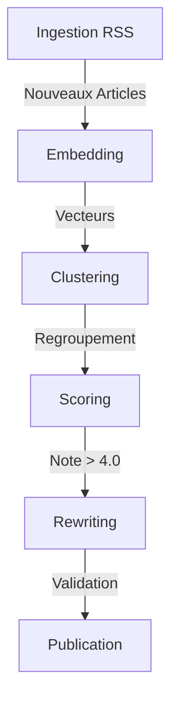

# Nexus Curation - Architecture Technique

## 1. Vue d'ensemble du Pipeline
Le système traite les flux RSS via un pipeline en 5 étapes séquentielles.

## 2. Stratégie IA (Janvier 2026)

Le moteur utilise une approche **"Tiered AI"** pour optimiser le rapport Coût/Performance.

| Tâche | Tier | Modèle OpenAI (Éco) | Modèle Anthropic (Perf) | Google (Défaut) |
| :--- | :--- | :--- | :--- | :--- |
| **Scoring** (Volume) | **FAST** | `gpt-5-mini` ($0.25/1M) | `claude-haiku-4-5` ($1.00/1M) | `gemini-3-flash` |
| **Rewriting** (Qualité) | **SMART** | `gpt-5.2` | `claude-sonnet-4-5` | `gemini-3-flash` |

### Batch Scoring (Optimisation Vitesse)
Pour noter rapidement des milliers d'articles, nous utilisons le **Batch Processing** :
- **Principe** : Envoyer plusieurs articles (Titres + Extraits) dans un seul prompt structuré.
- **Taille du Batch** :
  - **Mode Gratuit** : 5 articles / appel (Délai 2.5s).
  - **Mode Turbo (Clé Payante)** : **25 articles / appel** (Délai 0.1s).
- **Gain** : Divise le nombre de requêtes HTTP par 25 et réduit la latence totale de ~80%.

## 3. Gestion des Processus

### Shared State & Concurrency
Le système utilise un état partagé en Base de Données (`app_state`) pour coordonner les sessions.
- **Locking** : Un seul processus peut tourner à la fois (mutex sur `step`).
- **Monitoring** : La progression (`current`/`total`) est synchronisée en temps réel dans la DB, permettant à tous les clients connectés (onglets) de voir l'avancement global ("Reste à traiter").

### Auto-Loop
Le frontend gère une boucle "Infinie" qui relance le traitement tant qu'il reste des éléments :
1. Client demande traitement (Batch de 50).
2. Serveur traite et met à jour la DB.
3. Client reçoit confirmation, cumule les stats locales, et relance.

## 4. Base de Données (Supabase)

### Tables Clés
- **articles** : Contient le contenu, l'embedding (vector), le `relevance_score` et le `cluster_id`.
- **clusters** : Groupes d'articles similaires.
- **app_state** : Stockage JSON pour la config, l'état d'exécution et la progression.

### Vecteurs
Utilise `pgvector` pour la recherche de similarité sémantique (Deduplication et Clustering).
- Modèle Embedding : `text-embedding-004` (Gemini) ou via OpenAI si configuré.
