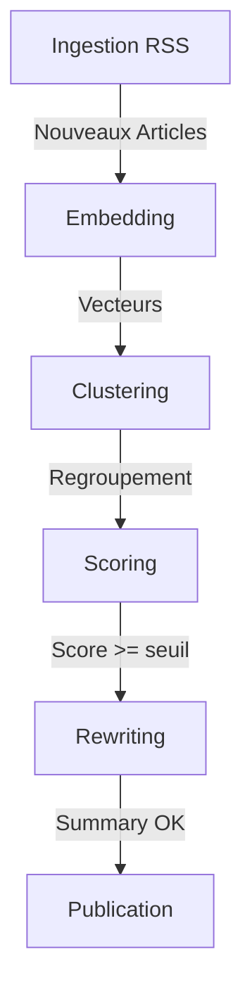

# Nexus Curation - Architecture Technique

## 1. Vue d'ensemble du Pipeline
Le système traite les flux RSS via un pipeline en 6 étapes. L'ingestion est un endpoint dédié, puis le processing enchaîne 4 étapes dans `/api/process`. La publication est effectuée dans l'étape de rewriting.

### Endpoints principaux
- **`/api/ingest`** : parse les RSS, scrape le contenu complet, ignore les articles trop anciens.
- **`/api/process`** : pipeline séquentiel (`embedding` → `clustering` → `scoring` → `rewriting/publish`).
- **`/api/refresh`** : enchaîne ingestion + 1–3 cycles de processing.
- **`/api/digest`** : génère un digest à la demande à partir des articles résumés des dernières 24h.

## 2. Stratégie IA (Janvier 2026)
Le moteur applique une stratégie **"Tiered AI"** et sélectionne automatiquement le meilleur provider disponible.

| Tâche | Tier | Modèles supportés (si clé dispo) | Fallback |
| :--- | :--- | :--- | :--- |
| **Scoring** | **FAST** | `gpt-5-mini` / `claude-haiku-4-5` / `gemini-3-flash-preview` | `llama-3.3-70b-versatile` (Groq) |
| **Rewriting** | **SMART** | `gpt-5.2` / `claude-sonnet-4-5-20250929` / `gemini-3-flash-preview` | `llama-3.3-70b-versatile` (Groq) |
| **Embeddings** | **VECTOR** | `text-embedding-004` (Gemini) | — |

### Sélection des providers
Ordre de priorité côté serveur :
1. **Clés utilisateur** (UI Admin, stockées en localStorage)
2. **Clés "payantes" d'environnement** (`PAID_*`)
3. **Clés par défaut** (ex: `GOOGLE_API_KEY`)
4. **Fallback Groq** (`GROQ_API_KEY`)

### Mode Turbo (si clé payante)
- **`processingLimit`** : 50 éléments par cycle (au lieu de 10)
- **`llmDelayMs`** : 100 ms (au lieu de 2500 ms)

## 3. Règles de Publication (centralisées)
Définies dans `src/lib/publication-rules.ts` et réutilisées par l'admin + l'API.

- **Seuil de publication** : `PUBLISH_THRESHOLD = 8.0`
- **Sources minimum** : `MIN_SOURCES = 2`
- **Fraîcheur** : `FRESHNESS_HOURS = 48`
- **Maturité cluster** : `CLUSTER_MATURITY_HOURS = 6`
- **Ingestion max age** : `INGESTION_MAX_AGE_HOURS = 720` (30 jours)

Les valeurs peuvent être **surchargées** par l'admin via query/body (`freshOnly`, `minSources`, `publishThreshold`, `ignoreMaturity`).

## 4. Gestion des Processus

### Shared State & Concurrency
L'état est centralisé en DB (`app_state`) pour coordonner les sessions et éviter la concurrence.
- **Locking** : un seul process actif (mutex sur `step`).
- **Stop/Reset** : `/api/admin/processing-state`.
- **Progression** : `current/total/label` synchronisés pour l'UI admin.

### Auto-Loop (AutoProcessor)
Boucle automatique côté Admin :
1. Lance l'ingestion RSS.
2. Enchaîne `process` tant qu'il reste des éléments.
3. Gère les erreurs 429 (backoff) et les pauses quand la file est vide.

## 5. Console Admin
La console `/admin` centralise les opérations métiers.

- **Pilotage auto** : AutoProcessor (processing loop + rate limit management).
- **Étapes manuelles** : déclenchement par étape, filtres (fraîcheur, sources min, score) et ingestion par source.
- **Éditorial** : gestion des clusters (publication, rejet, suppression, rewrite manuel).
- **Clusters** : listing multi-sources + test de similarité entre 2 articles.
- **Analytics** : Pulse 72h, Trend 30j, top sources, distribution des scores.
- **IA Settings** : clés temporaires (OpenAI/Anthropic/Gemini) + provider préféré.

## 6. Front Public
- **NewsFeed** : lecture des clusters publiés + summaries, filtres (date, archives, catégorie), tri score/date.
- **Reading List** : sauvegarde locale (localStorage) + table `reading_list` prête côté DB.
- **Articles** : pages détaillées (`/article/[id]`) et digest (`/digest/[id]`).

## 7. Base de Données (Supabase)

### Tables clés
- **articles** : source brute, `content`, `summary_short` (legacy, utilisé par `/api/digest`), `image_url`, `embedding`, `category`, `cluster_id`.
- **clusters** : agrégation éditoriale (`label`, `representative_article_id`, `final_score`, `is_published`, `published_on`, `category`, `image_url`).
- **summaries** : contenu généré (`title`, `content_tldr`, `content_analysis`, `content_full`, `image_url`, `source_count`).
- **sources** : catalogue RSS avec catégorie, `is_active`, `last_fetched_at`.
- **app_state** : mutex + progression pipeline.
- **digests** : digest quotidien JSON.
- **reading_list** : structure prête pour future auth.

### Vecteurs
`pgvector` sert à la similarité sémantique (RPC `find_similar_articles`).
Le seuil par défaut est **0.75** avec une fenêtre de **7 jours** (l'outil admin "similarité" affiche un indicateur à **0.70**).

## 8. Scripts utilitaires
Des scripts Node.js (`scripts/`) servent aux audits et migrations ponctuelles :
- harmonisation catégories, backfill clusters, diagnostics stats, sanity checks DB.
