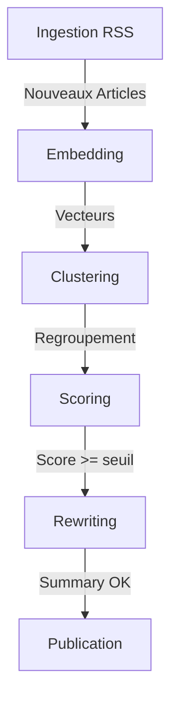

# Nexus Curation - Architecture Technique

## 1. Vue d'ensemble du Pipeline
Le système traite les flux RSS via un pipeline en 6 étapes. L'ingestion est un endpoint dédié, puis le processing enchaîne 4 étapes dans `/api/process`. La publication est effectuée dans l'étape de rewriting.

### Endpoints principaux
- **`/api/ingest`** : parse les RSS, scrape le contenu complet, ignore les articles trop anciens.
- **`/api/process`** : pipeline séquentiel (`embedding` → `clustering` → `scoring` → `rewriting/publish`).
- **`/api/admin/refresh`** : enchaîne ingestion + 1–N cycles de processing bornés.
- **`/api/digest`** : génère un digest à la demande à partir des articles résumés des dernières 24h.

## 2. Stratégie IA (Janvier 2026)
Le moteur applique une stratégie **"Tiered AI"** et sélectionne automatiquement le meilleur provider disponible.

| Tâche | Tier | Modèles supportés (si clé dispo) | Fallback |
| :--- | :--- | :--- | :--- |
| **Scoring** | **FAST** | `gpt-5-mini` / `claude-haiku-4-5` / `gemini-3-flash-preview` | `llama-3.3-70b-versatile` (Groq) |
| **Rewriting** | **SMART** | `gpt-5.2` / `claude-sonnet-4-5-20250929` / `gemini-3-flash-preview` | `llama-3.3-70b-versatile` (Groq) |
| **Embeddings** | **VECTOR** | `text-embedding-004` (Gemini) | — |

### Sélection des providers
Ordre de priorité côté serveur :
1. **Clés utilisateur** (UI Admin, stockées en localStorage)
2. **Clés "payantes" d'environnement** (`PAID_*`)
3. **Clés par défaut** (ex: `GOOGLE_API_KEY`)
4. **Fallback Groq** (`GROQ_API_KEY`)

### Throughput Mode (gratuit vs payant)
Le débit `process` dépend de la présence d'une clé payante active (user key ou `PAID_*` env).  
Les valeurs sont résolues par profil d'exécution dans `src/lib/pipeline/execution-policy.ts`.

| Profil | `processingLimit` free/paid | `llmDelayMs` free/paid |
| :--- | :--- | :--- |
| `api` | 8 / 24 | 3000 / 250 |
| `manual` | 12 / 45 | 2000 / 120 |
| `refresh` | 8 / 20 | 2500 / 200 |
| `gha` | 24 / 100 | 900 / 60 |

## 3. Règles de Publication (centralisées)
Définies dans `src/lib/publication-rules.ts` et réutilisées par l'admin + l'API.

- **Seuil de publication** : `PUBLISH_THRESHOLD = 8.0`
- **Sources minimum** : `MIN_SOURCES = 2`
- **Fraîcheur** : `FRESHNESS_HOURS = 48`
- **Maturité cluster** : `CLUSTER_MATURITY_HOURS = 3`
- **Ingestion max age** : `INGESTION_MAX_AGE_HOURS = 720` (30 jours)

Les valeurs peuvent être **surchargées** par l'admin via query/body (`freshOnly`, `minSources`, `publishThreshold`, `ignoreMaturity`).

### Cycle de Vie Éditorial (State Machine)
Les clusters évoluent selon une machine à états stricte (voir `docs/STATE_GRAPH.md`) et centralisée dans `src/lib/editorial-state.ts`.

États de référence:
1. **pending_scoring** : score non calculé.
2. **low_score** : score < seuil.
3. **incubating_maturity** : score OK mais maturité non atteinte.
4. **incubating_sources** : score OK mais sources uniques insuffisantes.
5. **incubating_maturity_sources** : double blocage (maturité + sources).
6. **eligible_rewriting** : cluster publiable automatiquement.
7. **archived** : cluster hors fenêtre de fraîcheur.
8. **published** : publié.
9. **anomaly_empty / anomaly_summary_unpublished** : incohérences à surveiller.

Règle de maturité:
- L'ancre de maturité est la date du **premier article** (`oldest published_at`), avec fallback `clusters.created_at` si les dates article sont absentes.

Couverture des onglets éditoriaux:
- **File d'attente** = `eligible_rewriting`.
- **Attente maturité** = `incubating_maturity` uniquement.
- **Attente sources** = `incubating_sources` + `incubating_maturity_sources`.
- **Archives** = `archived`.
- **Anomalies** = `anomaly_*`.

## 4. Gestion des Processus

### Shared State & Concurrency
L'état est centralisé en DB (`app_state`) pour coordonner les sessions et éviter la concurrence.
- **Locking** : un seul process actif (mutex sur `step`).
- **Stop/Reset** : `/api/admin/processing-state`.
- **Progression** : `current/total/label` synchronisés pour l'UI admin.

### Auto-Loop (AutoProcessor)
Boucle automatique côté Admin :
1. Lance l'ingestion RSS.
2. Enchaîne `process` tant qu'il reste des éléments.
3. Gère les erreurs 429 (backoff) et les pauses quand la file est vide.

### Orchestration modulaire du process
Le `process.ts` joue uniquement le rôle d'orchestrateur.  
Chaque étape est isolée et testable séparément :
- `src/lib/pipeline/steps/embedding-step.ts`
- `src/lib/pipeline/steps/clustering-step.ts`
- `src/lib/pipeline/steps/scoring-step.ts`
- `src/lib/pipeline/steps/rewriting-step.ts`

Types/context partagés :
- `src/lib/pipeline/types.ts` : API du pipeline (`ProcessOptions`, `ProcessResult`, `ProcessStep`).
- `src/lib/pipeline/process-context.ts` : contrat d'exécution injecté dans chaque étape.

### Profils d'Exécution (ingest/process)
Les contraintes runtime sont centralisées dans `src/lib/pipeline/execution-policy.ts`.

Profils supportés:
- `api` : routes API standard.
- `manual` : actions déclenchées depuis l'UI admin.
- `refresh` : exécution bornée pour `/api/admin/refresh`.
- `gha` : crons GitHub Actions (fenêtre d'exécution longue).

#### Matrice Process (février 2026)
| Profil | `maxExecutionMs` | `processingLimit` (free/paid) | `llmDelayMs` (free/paid) | Usage principal |
| :--- | :--- | :--- | :--- | :--- |
| `api` | 120000 (2 min) | 8 / 24 | 3000 / 250 | Appels API unitaires |
| `manual` | 360000 (6 min) | 12 / 45 | 2000 / 120 | Boucles interactives admin |
| `refresh` | 75000 (75 s) | 8 / 20 | 2500 / 200 | `/api/admin/refresh` anti-timeout |
| `gha` | 1080000 (18 min) | 24 / 100 | 900 / 60 | Cron GitHub Actions |

#### Matrice Ingest (février 2026)
| Profil | `batchSize` | `batchDelayMs` | `sourceConcurrency` | `sourceTimeoutMs` | `retrySourceTimeoutMs` |
| :--- | :--- | :--- | :--- | :--- | :--- |
| `api` | 8 | 250 | 6 | 9000 | 8000 |
| `manual` | 12 | 120 | 8 | 10000 | 9000 |
| `refresh` | 6 | 300 | 4 | 7000 | 6000 |
| `gha` | 24 | 40 | 14 | 15000 | 12000 |

#### Overrides, bornes et priorité
Priorité de résolution:
1. Valeurs par profil (source de vérité).
2. Mode throughput (`free`/`paid`) selon présence de clés payantes.
3. Overrides explicites, avec clamp :
   - process : query/body sur `/api/process`
   - ingest : options runtime via scripts (`cron-ingest.ts`, appels internes)

Bornes de sécurité:
- `maxExecutionMs`: 10000 → 3600000
- `processingLimit`: 1 → 500
- `llmDelayMs`: 0 → 30000
- `useProcessingState`: booléen (default `true`, non clampé)
- `batchSize`: 1 → 200
- `batchDelayMs`: 0 → 10000
- `sourceConcurrency`: 1 → 100
- `sourceTimeoutMs` / `retrySourceTimeoutMs`: 1000 → 120000

Consommateurs des profils:
- `/api/process` : `executionProfile` (body) ou `profile` (query), default `api`.
- `/api/ingest` : `profile` (query), default `api`.
- `/api/admin/refresh` : force profil `refresh`.
- `scripts/cron-process.ts` + `scripts/cron-ingest.ts` : force profil `gha`.
- `AutoProcessor` / `ManualSteps` : appellent `manual`.

## 5. Console Admin
La console `/admin` centralise les opérations métiers.

- **Pilotage auto** : AutoProcessor (processing loop + rate limit management).
- **Étapes manuelles** : déclenchement par étape, filtres (fraîcheur, sources min, score) et ingestion par source.
- **Éditorial** : gestion des clusters par état métier (file d'attente, maturité, sources, scoring, archives, anomalies).
- **Clusters** : listing multi-sources + test de similarité entre 2 articles.
- **Analytics** : Pulse 72h, Trend 30j, top sources, distribution des scores.
- **IA Settings** : clés temporaires (OpenAI/Anthropic/Gemini) + provider préféré.

### Continuité des métriques (Dashboard)
Le dashboard `/admin` expose désormais les contrôles de cohérence suivants:
- **Scoring (clusters)**: `scored = relevant + rejected` (delta affiché si non nul).
- **Pertinents non publiés**: décomposés en `actionnable + maturité + sources + fraîcheur + synthèse non publiée + anomalies` (delta affiché si non nul).
- **Diffusion**: compteur principal sur les **sujets pertinents publiés**, avec sous-total "total publiés" pour distinguer les publications historiques hors seuil courant.

## 6. Front Public
- **NewsFeed** :
    - **Navigation** : Sidebar simplifiée (Temps : Aujourd'hui/Hier/Semaine/Archives) + Pills catégories.
    - **Featured ("À la Une")** : Top 3 ranking (Score pondéré + Consensus) affiché en Hero/Compact au-dessus du flux.
    - **Flux** : Liste chronologique ou par score, cartes avec indicateurs de sources multiples.
- **Reading List** : sauvegarde locale (localStorage) + table `reading_list` prête côté DB.
- **Articles** : pages détaillées (`/article/[id]`) et digest (`/digest/[id]`).
- **Story** : page de partage (`/story/[id]`) dédiée aux clusters publiés, avec métadonnées Open Graph (Social Preview).

## 7. Base de Données (Supabase)

### Tables clés
- **articles** : source brute, `content`, `summary_short` (legacy, utilisé par `/api/digest`), `image_url`, `embedding`, `category`, `cluster_id`.
  - *Index* : `articles_cluster_id_idx` ajouté pour optimiser les jointures de comptage dans l'admin.
- **clusters** : agrégation éditoriale (`label`, `representative_article_id`, `final_score`, `is_published`, `published_on`, `category`, `image_url`).
- **summaries** : contenu généré (`title`, `content_tldr`, `content_analysis`, `content_full`, `image_url`, `source_count`).
- **sources** : catalogue RSS avec catégorie, `is_active`, `last_fetched_at`.
- **app_state** : mutex + progression pipeline.
- **digests** : digest quotidien JSON.
- **reading_list** : structure prête pour future auth.

### Vecteurs
`pgvector` sert à la similarité sémantique (RPC `find_similar_articles`).
Le seuil par défaut est **0.75** avec une fenêtre de **7 jours** (l'outil admin "similarité" affiche un indicateur à **0.70**).

## 8. Scripts utilitaires
Des scripts Node.js (`scripts/`) servent aux audits et migrations ponctuelles :
- harmonisation catégories, backfill clusters, diagnostics stats, sanity checks DB.
- **cron-ingest.ts** : Point d'entrée standalone pour l'ingestion RSS (GitHub Actions).
- **cron-process.ts** : Point d'entrée standalone pour le pipeline IA (GitHub Actions).

## 9. Automatisation (GitHub Actions)
Les jobs de cron sont externalisés dans `.github/workflows/` pour éviter les limites Vercel (timeout 300s) :
- **cron-process.yml** : Orchestrateur principal.
  - `17,47 * * * *` : tick `process_only`.
  - `12 */2 * * *` : tick `ingest_then_process`.
  - Pre-check backlog en `process_only` (`cron:should-process`) pour éviter les exécutions vides.
  - Skip du process sur le tick ingest si `articlesIngested = 0`.
  - Sur `ingest_then_process`, drain par étapes (`embedding` → `clustering` → `scoring` → `rewriting`) avec boucles bornées.
  - `MAX_EXECUTION_MS=1080000`, timeout workflow 30min.
- **cron-ingest.yml** : lancement manuel uniquement (`workflow_dispatch`) pour debug.

Les scripts utilisent `dotenv` pour charger `.env.local` en développement local, mais reçoivent les secrets via `secrets.*` en CI.

## 10. Gestion Base de Données (Workflow Safe)
Depuis ADR-022, la gestion est **100% programmatique** via Supabase CLI.
- **Interdit** : Modifier le schéma via l'interface web (sauf urgence).
- **Workflow** : 
  1. `npm run db:dump` (Backup)
  2. `npm run db:pull` (Sync remote changes)
  3. `npm run db:types` (Sync TypeScript)

### Environnement Local
Une instance Docker complète est disponible pour le dév risqué :
- `npm run db:start` / `npm run db:stop`
- Bascule via `.env.local`.
