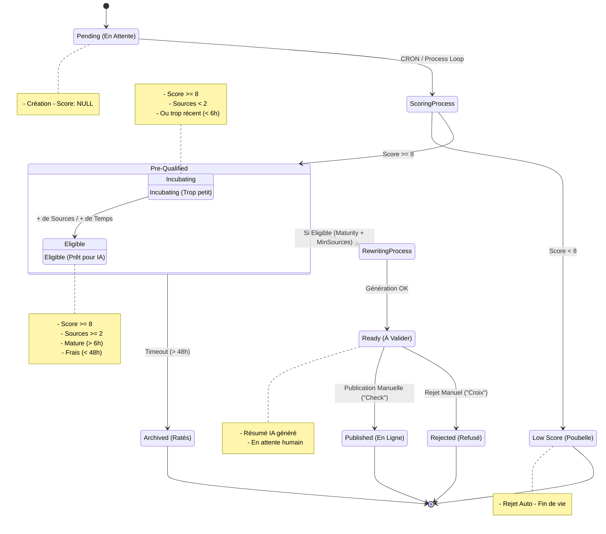

# Diagramme des États (Cluster Lifecycle)

Ce diagramme décrit le cycle de vie d'un Cluster de news, de sa création à sa publication ou son archivage.

## Définitions des Conditions

| État | Condition Technique | Description |
| :--- | :--- | :--- |
| **Pending** | `final_score IS NULL` | Vient d'arriver. En attente du script de scoring. |
| **Low Score** | `final_score < 8` | Jugé non pertinent par l'IA. |
| **Incubating** | `score >= 8` ET (`sources < 2` OU `age < 6h`) | Potentiel détecté, mais trop "faible" ou trop récent pour être traité. |
| **Eligible** | `score >= 8` ET `sources >= 2` ET `age > 6h` ET `age < 48h` | **La cible**. Prêt pour la génération de synthèse. |
| **Ready** | `score >= 8` ET `summary IS NOT NULL` ET `!published` | Le travail de l'IA est fini. L'humain doit valider ou rejeter. |
| **Published** | `is_published = true` | Visible sur le site. |
| **Archived** | `score >= 8` ET `!summary` ET `age > 48h` | Était bon, mais a expiré avant de devenir Eligible (manque de sources, bug). |
