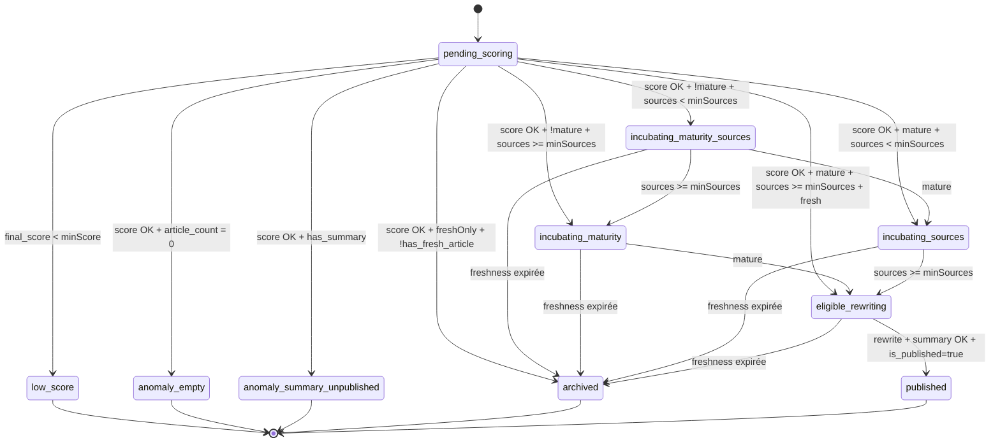

# Diagramme des États (Editorial State Machine)

Ce document décrit la machine à états utilisée partout dans l'admin:
- `/api/admin/articles` (tabs éditoriales),
- `/api/admin/stats` (dashboard et réconciliation),
- `runProcess()` étape rewriting (`/api/process`).

La source unique est `src/lib/editorial-state.ts`.

## Définitions Techniques

| État | Condition |
| :--- | :--- |
| `pending_scoring` | `final_score IS NULL` |
| `low_score` | `final_score < minScore` |
| `anomaly_empty` | `final_score >= minScore` ET `article_count = 0` |
| `anomaly_summary_unpublished` | `final_score >= minScore` ET `has_summary = true` ET `is_published = false` |
| `archived` | `final_score >= minScore` ET `freshOnly = true` ET `has_fresh_article = false` |
| `incubating_maturity_sources` | `final_score >= minScore` ET `!is_mature` ET `unique_sources < minSources` |
| `incubating_maturity` | `final_score >= minScore` ET `!is_mature` ET `unique_sources >= minSources` |
| `incubating_sources` | `final_score >= minScore` ET `is_mature` ET `unique_sources < minSources` |
| `eligible_rewriting` | `final_score >= minScore` ET `is_mature` ET `unique_sources >= minSources` ET `has_fresh_article = true` (si `freshOnly`) |
| `published` | `is_published = true` |

## Règle de Maturité

Ancre de maturité:
1. `oldest_article.published_at` (premier article du cluster),
2. fallback `clusters.created_at` si les `published_at` sont absents.

Cette règle permet de mesurer l'âge réel du sujet, pas l'heure de création technique du cluster.

## Mapping Onglets (UI Éditoriale)

| Onglet | États inclus |
| :--- | :--- |
| File d'attente | `eligible_rewriting` |
| Attente maturité | `incubating_maturity` |
| Attente sources | `incubating_sources`, `incubating_maturity_sources` |
| En attente scoring | `pending_scoring` |
| Publiés | `published` |
| Archives | `archived` |
| Faible intérêt | `low_score` |
| Anomalies | `anomaly_empty`, `anomaly_summary_unpublished` |
